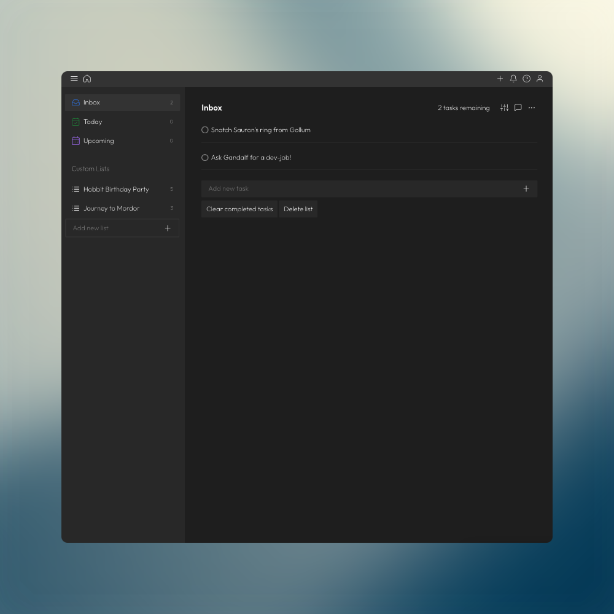

# Application - Todothis

📝 Literally the best todolist application in my neighborhood.

## Features

-   Responsive
-   Local storage
-   Custom lists
-   Edit tasks/lists

## Tech Stack

**Client:** Scss, JavaScript, Vite

**Server:** #

## Preview



## Run Locally

Clone the project:

```bash
  git clone https://github.com/harunjonuzi/app-todo-this.git
```

Go to the project directory:

```bash
  cd my-project
```

Install dependencies:

```bash
  npm install
```

Start the server:

```bash
  npm run dev
```

## Contributing

This is an open-source project and I welcome contributions from the community.

If you'd like to contribute, please fork the repository and make changes as you'd like. Pull requests are warmly welcome.

## Links

[](https://harunjonuzi.com/)
[](https://www.linkedin.com/in/harunjonuzi)
[](https://x.com/harunjonuzi)
