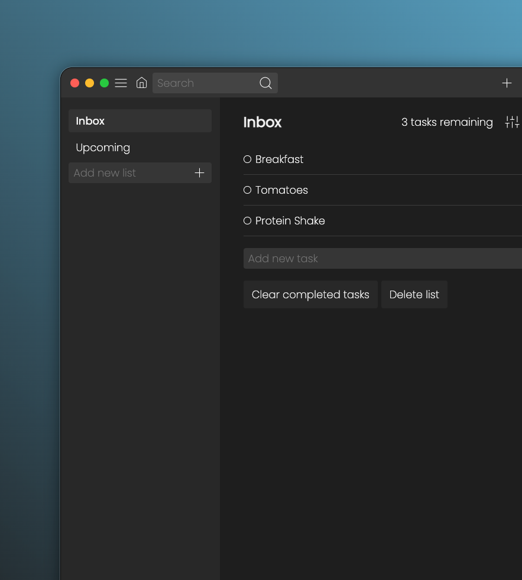

# Todoology

Literally the best todolist application on my neighbourhood.

## Table of contents

- [Overview](#overview)
- [Installation](#installation)
- [Features](#features)
- [Contributions](#contributing)
- [License](#license)

## Overview

## Installation

- Fork/clone the project from GitHub and start using it right away.

## Features

- Add custom lists
- Add tasks to custom lists
- Clear completed tasks & delete whole lists
- Remaining task counter
- Local storage

## Contributing
Contributions are always welcome!
Please adhere to this project's `code of conduct`.

## License
- 📜 Some README files effectively engage and encourage contributions to a project, while other README files unexpectedly cast doubt on the very meaning of your existence, leaving you pondering the mysteries of life and questioning your choices in the vast cosmic scheme of things.
